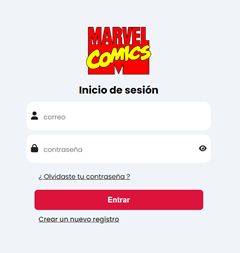

# FRONTEND API MARVEL TECNOFACTORY 


## 🏠 Descripción General



Este proyecto Angular es una aplicación web de una sola página (SPA) que implementa componentes standalone para una mayor modularidad y reutilización. Ha sido desarrollado como prueba técnica para TechnoFactory.

## 📋 Tabla de Contenidos

1. [Estructura del Proyecto](#estructura-del-proyecto)
2. [Instalación y Ejecución](#instalación-y-ejecución)
6. [Vista Previa](#vista-previa)
7. [Contacto](#contacto)

## 📒Estructura del proyecto

```code 
marvel-front/
├── src
│   ├── app
│   │   ├── components #Componentes reutilizables
│   │   ├── directives 
│   │   ├── guards
│   │   ├── interceptors
│   │   ├── models
│   │   ├── services
│   │   └── assets
│   │       
│   │       
│   └── index.html
```

## ❇️ Instalación y Ejecución

> Prerrequisitos

### Asegúrese de tener instalado

- **Node.js y npm (o yarn):** Node para ejecutar la aplicación (https://nodejs.org/) 
- **GIT:** Git para clonar el repostorio (https://git-scm.com)
- **Angular CLI:** Instala el Angular CLI globalmente:


```code 
npm install -g @angular/cli
```

### Clonar el Repositorio

Clone este repositorio en tu máquina local:

```Bash
git clone LINK_COPIADO_DEL_REPOSITORIO
```

### Instalar Dependencias

Navegue al directorio del proyecto:

```Bash
cd marvel-front
```
instale las dependencias necesarias con el comando

```Bash
npm install
```

### Ejecutar proyecto

```Bash
npm start
```

## 📄 Vista previa

El proyecto se encuentra online en un servicio de netlify
[VER PROYECTO ONLINE]()

## 📲 Contacto
Si tiene alguna pregunta o sugerencia, no dude en contactarme danielramos9991@gmail.com

[Visitar portafolio web](https://danielramos.netlify.app)
